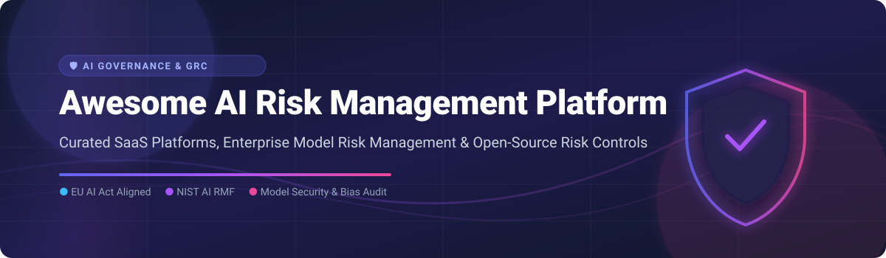

# Awesome AI Risk Management Platform 🛡️

## 🚀 Top AI Risk Management & Governance Ecosystem

    

**A Curated List of Commercial Enterprise SaaS Platforms & Open-Source GitHub Projects** for **AI Risk Management**, **Model Risk Management (MRM)**, **AI Governance**, **Fairness & Bias Audit**, **Regulatory Compliance (EU AI Act, NIST AI RMF)**, and **Continuous AI Oversight**.

---

## 📑 Table of Contents
- [🌐 Market Overview & Insights](#-market-overview--insights)
- [🏢 Enterprise SaaS & Hosted Platforms](#-enterprise-saas--hosted-platforms)
- [🔓 Open-Source GitHub Projects](#-open-source-github-projects)
- [🛠️ Key Functional Building Blocks](#-key-functional-building-blocks)
- [🤝 How to Contribute](#-how-to-contribute)
- [💖 Support & Sponsorship](#-support--sponsorship)
- [⚖️ Disclaimer](#-disclaimer)
- [📈 Star History](#-star-history)

---

## 🌐 Market Overview & Insights

> **Market Size & Structure**: The global AI Risk Management and Governance Market is estimated to reach **~$2.5 Billion - $3.8 Billion** with a CAGR of over 35%. The market is currently **moderately fragmented**, featuring established enterprise tech giants alongside fast-growing specialized AI GRC and security startups. While consolidation is under way (e.g., Snowflake acquiring TruEra), no single player commands a "winner-take-all" monopoly due to diverse regulatory requirements across global jurisdictions (e.g., EU AI Act vs. NIST AI RMF).

---

## 🏢 Enterprise SaaS & Hosted Platforms

The table below summarizes leading commercial platforms that provide end-to-end model inventory, impact assessment, regulatory compliance workflows, and continuous AI monitoring. Sorted by **Estimated Corporate Scale / Valuation / Total Funding (Descending)**.

| Platform | Corporate Scale / Valuation / Funding 📈 | Pricing 💳 | Free Tier Limit / Free Trial 🆓 | Description & Key Features 🔑 |
| :--- | :--- | :--- | :--- | :--- |
| **[IBM watsonx.governance](https://www.ibm.com/watsonx/governance)** | **~$170 Billion Market Cap** (IBM) | **$1,500 / month** starting base plan | **30-Day Free Trial** (5,000 resource units/mo included) | Comprehensive enterprise AI governance module for risk management, lifecycle compliance, and regulatory alignment. |
| **[Protect AI](https://protectai.com/)** | **~$450 Million Valuation** ($108M+ Raised) | **$2,500 / month** starting team tier | **Free Community Tier** (Up to 10 model scans & repository builds/month) | AI/ML security and risk platform spanning model vulnerability scanning, supply chain security, and runtime controls. |
| **[Credo AI](https://www.credo.ai/)** | **~$150 Million Valuation** ($29M+ Raised) | **$1,200 / month** starting standard workspace | **14-Day Free Trial** (Full access for up to 3 AI use cases) | Governance platform for automated risk assessment, policy management, and compliance across enterprise AI portfolios. |
| **[Holistic AI](https://www.holisticai.com/)** | **~$100 Million Valuation** ($15M+ Raised) | **$1,000 / month** starting starter tier | **14-Day Free Trial** (Includes 1 AI system audit & bias screening) | AI risk management platform covering bias, robustness, efficacy, and legal compliance workflows for global enterprises. |
| **[CalypsoAI](https://www.calypsoai.com/)** | **~$95 Million Valuation** ($38M+ Raised) | **$2,000 / month** starting enterprise starter | **14-Day Free Trial** (Includes up to 50,000 API security prompt scans) | Real-time AI security, model testing, and guardrailing platform providing auditability and defense for GenAI models. |
| **[ModelOp](https://www.modelop.com/)** | **~$60 Million Valuation** ($22M+ Raised) | **$3,000 / month** starting enterprise node | **30-Day Free Trial** (Limited to 2 production model pipelines) | Enterprise Model Risk Management (MRM) software focused on automated governance, model inventory, and operational controls. |
| **[FairNow](https://www.fairnow.ai/)** | **~$25 Million Valuation** ($3.5M+ Raised) | **$500 / month** starting starter plan | **14-Day Free Trial** (Up to 2 active AI models monitored) | AI governance platform automating compliance monitoring, bias detection, and risk tracking for enterprise HR & Fintech models. |
| **[Monitaur](https://monitaur.ai/)** | **~$20 Million Valuation** ($6M+ Raised) | **$750 / month** starting compliance tier | **30-Day Free Trial** (Includes access for 1 business model validation) | Auditability and assurance software for enterprise AI risk, governance, and regulatory compliance. |
| **[Trustible](https://www.trustible.ai/)** | **~$15 Million Valuation** ($3.2M+ Raised) | **$400 / month** starting launch plan | **Free Forever Tier** (1 user seat, 1 active AI model inventory) | Governance SaaS enabling compliance with EU AI Act, NIST AI RMF, and ISO 42001 standards. |
| **[TruEra](https://truera.com/)** *(Acquired by Snowflake)* | **Acquired** ($25M+ Raised prior) | **$1,500 / month** starting TruEra Cloud tier | **14-Day Free Trial** (Includes 100K test evaluate calls) | AI observability and model risk evaluation platform for LLMs and ML models. |

---

## 🔓 Open-Source GitHub Projects

Below are key open-source repositories powering model security, evaluation, monitoring, and compliance. Repositories are sorted by **GitHub Star Count (Descending)**.

| Project Name 📦 | GitHub Stars ⭐ | Category 🏷️ | Key Capabilities & Use Cases 🛠️ |
| :--- | :--- | :--- | :--- |
| **[cleanlab/cleanlab](https://github.com/cleanlab/cleanlab)** |  | Data Risk & Quality | Standard data-centric AI package for detecting dataset errors, label noise, and data risk in ML models. |
| **[arize-ai/phoenix](https://github.com/arize-ai/phoenix)** |  | AI Observability & Risk | AI observability and evaluation platform for tracing, evaluations, prompt engineering, and LLM vulnerability analysis. |
| **[evidentlyai/evidently](https://github.com/evidentlyai/evidently)** |  | Operational Drift & Monitoring | Open-source ML/LLM evaluation framework to evaluate, test, and monitor data drift and model performance. |
| **[guardrails-ai/guardrails](https://github.com/guardrails-ai/guardrails)** |  | Runtime Guardrails | Adding structure, type validation, and quality/safety risk assertions to Large Language Model outputs. |
| **[NVIDIA/NeMo-Guardrails](https://github.com/NVIDIA/NeMo-Guardrails)** |  | Runtime Safety & Guardrails | Open toolkit for adding programmable guardrails to LLM-based conversational applications. |
| **[giskard-ai/giskard](https://github.com/giskard-ai/giskard)** |  | Testing & Evaluation | Open-source testing framework dedicated to discovering LLM vulnerabilities, hallucination, and performance risks. |
| **[deepchecks/deepchecks](https://github.com/deepchecks/deepchecks)** |  | Testing & Validation | Validation solution for data integrity, model drift, and performance checks across the ML pipeline. |
| **[truera/trulens](https://github.com/truera/trulens)** |  | LLM Evaluation | Evaluation and tracking instrumentation for LLM applications based on RAG feedback loops and risk metrics. |
| **[laiyer-ai/llm-guard](https://github.com/laiyer-ai/llm-guard)** |  | Security & Guardrails | Security toolkit designed to detect prompt injection, data leakage, toxicity, and sanitize LLM inputs/outputs. |
| **[trusted-ai/AIF360](https://github.com/trusted-ai/AIF360)** |  | Bias & Fairness Audit | IBM's AI Fairness 360 open-source toolkit for measuring and mitigating algorithmic bias in machine learning models. |
| **[fairlearn/fairlearn](https://github.com/fairlearn/fairlearn)** |  | Bias & Fairness Audit | Python library to assess fairness and mitigate unfairness in machine learning systems. |
| **[protectai/modelscan](https://github.com/protectai/modelscan)** |  | Supply Chain Security | Open-source security scanner protecting against code execution in serialized ML models (Pickle, H5, PyTorch). |
| **[SdSarthak/AegisAI](https://github.com/SdSarthak/AegisAI)** |  | AI GRC Platform | Open-source AI risk classification and EU AI Act compliance management tool. |

---

## 🛠️ Key Functional Building Blocks

Combining modular open-source components allows building a custom enterprise AI risk pipeline:

1. **Inventory & System Registration**: Registration of model artifacts and prompt pipelines (e.g., AegisAI, custom registries).
2. **Supply Chain Security Scanning**: Pre-deployment inspection of serialized models (e.g., ModelScan).
3. **Pre-deployment Testing & Validation**: Deep checks for dataset quality, hallucinations, and bias (e.g., Cleanlab, Giskard, Deepchecks, AIF360, Fairlearn).
4. **Runtime Security & Guardrailing**: Real-time filtering of prompt injections and toxic outputs (e.g., LLM Guard, NeMo Guardrails, Guardrails AI).
5. **Continuous Observability & Monitoring**: Tracking live model drift and RAG metrics (e.g., Evidently AI, Phoenix, TruLens).

---

## 🤝 How to Contribute

Contributions are always welcome! 

1. 🍴 **Fork** the repository.
2. 📝 **Add your entry** to the appropriate section following the existing table schema.
3. 🔍 Ensure links are active and accurate.
4. 🚀 Submit a **Pull Request** with a brief summary of the added platform or open-source tool.

---

## 💖 Support & Sponsorship

If you found this curated list helpful for your AI Governance or Model Risk management journey, please consider supporting the project:

- ⭐ **Star** this repository on GitHub to increase visibility.
- 🍴 **Fork** and share it with fellow ML Security & AI Risk Officers.
- ☕ **Buy me a coffee / Sponsor**: You can support ongoing maintenance via the [GitHub Sponsor Dashboard](https://github.com/sponsors/ishandutta2007).

Thank you for your support and contributions!

---

## ⚖️ Disclaimer

- This repository is a **community-curated list** for informational and educational purposes.
- AI Risk Management policies depend on regulatory jurisdictions (e.g., EU AI Act, US NIST AI RMF, ISO/IEC 42001). Software tools facilitate compliance evidence but do not constitute formal legal counsel or compliance certification.

---

## 📈 Star History

---

  <b>Built with ❤️ for AI Risk Officers, ML SecOps Engineers, and Governance Teams.</b>

